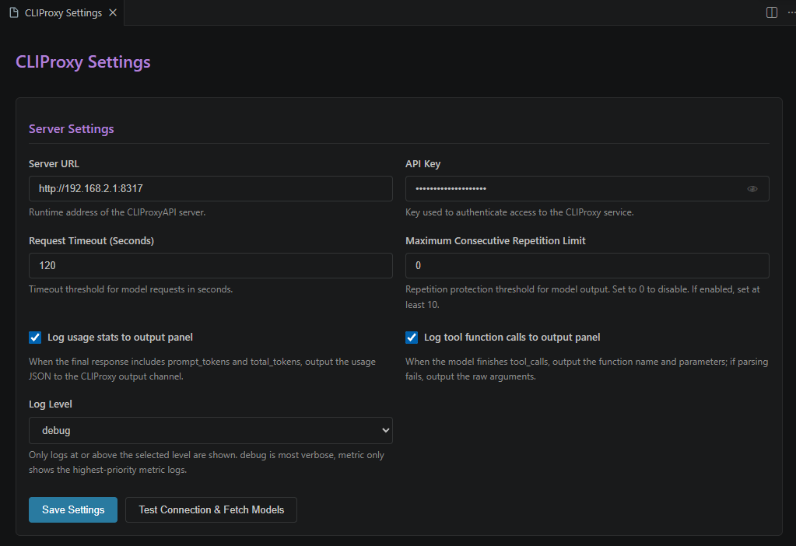
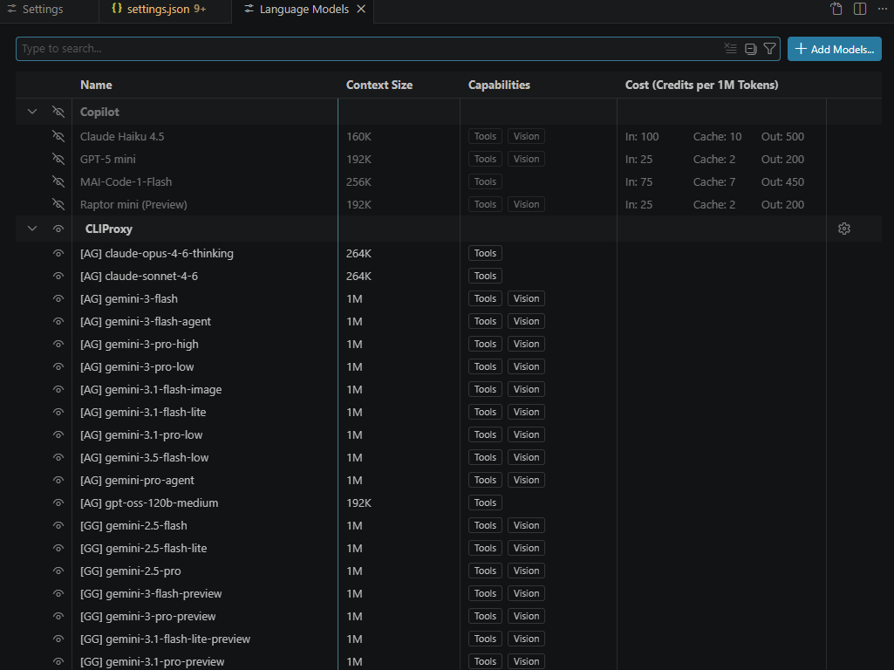
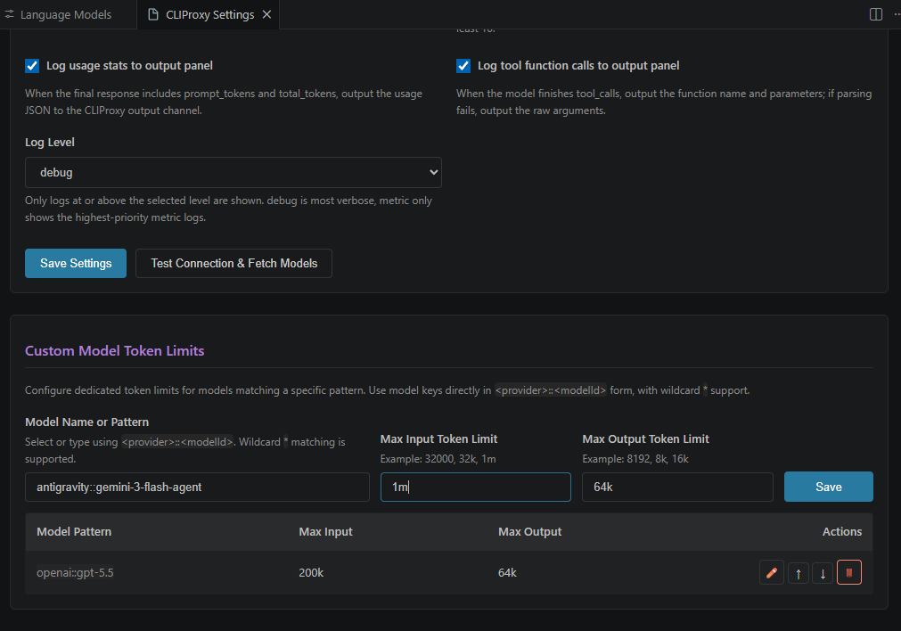

<details>
<summary>简体中文 (Simplified Chinese)</summary>

# CLIProxy for Copilot

## 项目简介

**CLIProxy for Copilot** 是一个 VS Code 扩展，它将 [CLIProxyAPI](https://github.com/router-for-me/CLIProxyAPI) 注册为 VS Code 的自定义语言模型提供商（Language Model Chat Provider）。

通过此扩展，你可以直接在 VS Code Copilot Chat 中使用由 CLIProxyAPI 代理的各种大模型（如 Gemini 2.5 Pro, GPT-5, Claude 3.7 Sonnet 等），无需直接配置昂贵的 API Key，充分利用你已有的 OAuth 订阅或免费配额。

## 核心功能

- **模型自动发现**：自动从 CLIProxyAPI 服务器拉取可用模型列表。
- **原生集成**：在 Copilot Chat 的模型选择器中直接切换，享受原生的聊天体验。
- **流式响应**：支持 SSE 流式输出，响应速度快。
- **工具调用支持**：支持 Copilot 的工具调用（Tool Calling）能力。
- **配置简单**：支持通过命令或设置界面快速配置服务器地址和 API Key。
- **界面文本国际化**：扩展运行时提示支持 VS Code 官方国际化机制，中文界面下可显示中文提示。

## 快速开始

1. **安装扩展**：在 VS Code 中安装此扩展。
2. **配置服务器**：
   - 运行命令 `CLIProxy: 配置服务器地址和 API Key`。
   - 输入你的 CLIProxyAPI 服务器地址（默认 `http://localhost:8317`）。
   - 如果服务器设置了访问密钥，请输入 API Key。
3. **使用模型**：

- 打开 Copilot Chat 窗口。
- 点击模型选择器，选择 CLIProxy 提供的模型。
- 开始对话！

## 扩展设置

此扩展贡献了以下设置：

- `cliproxy.serverUrl`: CLIProxyAPI 服务器的地址。
- `cliproxy.apiKey`: 访问服务器所需的 API Key（可选）。
- `cliproxy.requestTimeout`: 请求超时时间（秒）。
- `cliproxy.logUsageStats`: 当响应结尾携带 usage 统计时，是否在 CLIProxy 输出面板记录 usage JSON。
- `cliproxy.logToolCalls`: 当响应返回工具调用时，是否在 CLIProxy 输出面板记录工具函数名与参数。
- `cliproxy.logLevel`: 输出面板日志等级，可选 `debug` / `info` / `warn` / `error` / `metric`，仅显示大于或等于当前等级的日志。
- `cliproxy.customTokenLimits`: 按顺序匹配的自定义 Token 限制规则数组，直接使用 `<provider>::<modelId>` 形式的模型 ID 或通配符模式。

中文示例：

```json
"cliproxy.customTokenLimits": [
  {
    "pattern": "openai::gpt-5*",
    "maxInputTokens": "1m",
    "maxOutputTokens": "64k"
  },
  {
    "pattern": "openai::gpt-4*",
    "maxInputTokens": "128k",
    "maxOutputTokens": "16k"
  },
  {
    "pattern": "claude::claude-3.7-*",
    "maxInputTokens": "200k",
    "maxOutputTokens": "64k"
  }
]
```

> 说明：`pattern` 直接使用 `<provider>::<modelId>` 形式，例如 `openai::gpt-5*`。如果需要批量匹配，可继续使用 `*` 通配符，例如 `openai::gpt-4*`。

For logging, most current output panel messages are recorded at `debug` level by default, while usage statistics are recorded at `metric` level. Since `metric` is higher than `error`, setting the log level to `metric` will only show these highest-priority metric lines. If `cliproxy.logToolCalls` is enabled, tool call details are also emitted at `metric` level so they can be isolated the same way.

## 常见问题

- **Q: 为什么模型列表里没有看到 CLIProxyAPI 的模型？**
  - A: 请确保 CLIProxyAPI 服务器已启动且地址配置正确。你可以运行 `CLIProxy: 刷新可用模型列表` 命令手动触发刷新。
- **Q: 是否支持图片输入？**
  - A: 扩展会根据模型名称自动推断多模态能力，支持多模态的模型可以直接发送图片。

</details>

---

## Introduction





**CLIProxy for Copilot** is a VS Code extension that registers [CLIProxyAPI](https://github.com/router-for-me/CLIProxyAPI) as a custom Language Model Chat Provider for VS Code.

With this extension, you can use various large language models (such as Gemini 2.5 Pro, GPT-5, Claude 3.7 Sonnet, etc.) proxied by CLIProxyAPI directly within VS Code Copilot Chat. It allows you to leverage your existing OAuth subscriptions or free quotas without needing expensive API keys.

## Key Features

- **Automatic Model Discovery**: Automatically fetches the list of available models from your CLIProxyAPI server.
- **Native Integration**: Switch models directly in the Copilot Chat model picker for a seamless experience.
- **Streaming Responses**: Supports SSE streaming for fast and responsive interactions.
- **Tool Calling Support**: Fully compatible with Copilot's tool calling capabilities.
- **Easy Configuration**: Quickly configure server settings via commands or the settings UI.

## Quick Start

1. **Install the Extension**: Install this extension in your VS Code.
2. **Configure Server**:
   - Run the command `CLIProxy: Configure Server URL and API Key`.
   - Enter your CLIProxyAPI server URL (default: `http://localhost:8317`).
   - Enter the API Key if your server requires authentication.
3. **Use Models**:

- Open the Copilot Chat window.
- Click the model picker and select a model provided by CLIProxy.
- Start chatting!

## Extension Settings

This extension contributes the following settings:

- `cliproxy.serverUrl`: The URL of your CLIProxyAPI server.
- `cliproxy.apiKey`: The API Key required to access the server (optional).
- `cliproxy.requestTimeout`: Request timeout in seconds.
- `cliproxy.logUsageStats`: Whether to log the final response usage JSON to the CLIProxy output channel when usage stats are present.
- `cliproxy.logToolCalls`: Whether to log tool function names and parameters to the CLIProxy output channel when tool calls are returned.
- `cliproxy.logLevel`: Output panel log level. Available values: `debug` / `info` / `warn` / `error` / `metric`. Only logs at or above the selected level are shown.
- `cliproxy.customTokenLimits`: Ordered custom token limit rules array using model IDs or wildcard patterns in `<provider>::<modelId>` form.

Example:

```json
"cliproxy.customTokenLimits": [
  {
    "pattern": "openai::gpt-5*",
    "maxInputTokens": "1m",
    "maxOutputTokens": "64k"
  },
  {
    "pattern": "openai::gpt-4*",
    "maxInputTokens": "128k",
    "maxOutputTokens": "16k"
  },
  {
    "pattern": "claude::claude-3.7-*",
    "maxInputTokens": "200k",
    "maxOutputTokens": "64k"
  }
]
```

`pattern` uses the provider-qualified `<provider>::<modelId>` form directly, such as `openai::gpt-5*`. You can still use `*` for bulk matching, such as `openai::gpt-4*`.

For logging, most current output panel messages are recorded at `debug` level by default, while usage statistics are recorded at `metric` level. Since `metric` is higher than `error`, setting the log level to `metric` will only show these highest-priority metric lines. If `cliproxy.logToolCalls` is enabled, tool call details are also emitted at `metric` level so they can be isolated the same way.

## Troubleshooting

- **Q: Why don't I see CLIProxyAPI models in the list?**
  - A: Ensure your CLIProxyAPI server is running and the URL is correctly configured. You can run the `CLIProxy: Refresh Available Models` command to trigger a manual refresh.
- **Q: Does it support image input?**
  - A: The extension automatically infers multimodal capabilities based on the model name. Models that support vision can handle image inputs directly.

## License

[MIT](LICENSE)
